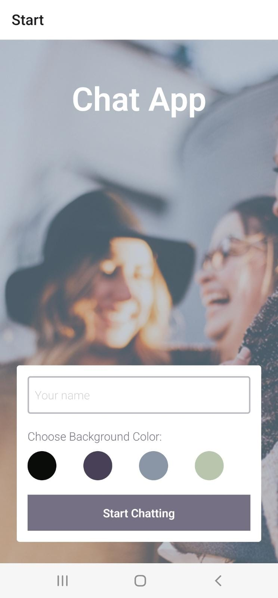

# chat-app

## Description

To build a chat app for mobile devices using React Native. The app will provide users with a chat interface and options to share images and their location.

## App screenshot



### User Stories

- As a new user, I want to be able to easily enter a chat room so I can quickly start talking to my friends and family.
- As a user, I want to be able to send messages to my friends and family members to exchange the latest news.
- As a user, I want to send images to my friends to show them what I’m currently doing.
- As a user, I want to share my location with my friends to show them where I am.
- As a user, I want to be able to read my messages offline so I can reread conversations at any time.
- As a user with a visual impairment, I want to use a chat app that is compatible with a screen reader so that I can engage with a chat interface.

### Key Features

- A page where users can enter their name and choose a background color for the chat screen before joining the chat.
- A page displaying the conversation, as well as an input field and submit button.
- The chat must provide users with two additional communication features: sending images and location data.
- Data gets stored online and offline.

### What technology did I use and why?

I am using **React Native** to create the mobile application due to following considerations:

- Develop and Maintain One Codebase
- Large and Active Community
- Web Developers Can Use Existing Skills
  I am using **XCode** as an iOS simulator and **Android Studio** as an Andriod emulator.

Using **expo** as development to develop and test the app.

I use the **React Navigation** third party library to navigate between screens.

I use the React Native [**Gifted Chat**](https://github.com/FaridSafi/react-native-gifted-chat) library to create the UI of my chat app. It already provides predefined components for integral parts of the chat app:

- Message bubbles

- A message input field

- A send button

- Options for displaying user names and avatars etc

I'm working with [**WebSocket**](https://developer.mozilla.org/en-US/docs/Web/API/WebSockets_API#guides) as a real-time application technology as it fulfills the following requirements of my chat application by two way communication:

- Transmitting in- and outgoing data immediately

- Two-way communication between clients and server

- Avoids data bloat compared to long polling

I use [**Cloud Firestore**](https://firebase.google.com/) as data storage platform for this application. real-time data

### User Stories

- As a new user, I want to be able to easily enter a chat room so I can quickly start talking to my friends and family.

  @@ -115,3 +137,80 @@ export PATH=/Users/myuser/Library/Android/sdk/platform-tools:$PATH

- As a user, I want to be able to send messages to my friends and family members to exchange the latest news.
- As a user, I want to send images to my friends to show them what I’m currently doing.
- As a user, I want to share my location with my friends to show them where I am.
- As a user, I want to be able to read my messages offline so I can reread conversations at any time.
- As a user with a visual impairment, I want to use a chat app that is compatible with a screen reader so that I can engage with a chat interface.

# Development Process

## Setup Expo as Development Environment

1. Install Expo CLI

```
npm insatll expo-cli --location=global
```

2. Create a new expo project

```
expo init [projectname]
```

3. Navigate to the project

```
cd [projectname]
```

4. Start expo project

```
npm start or expo start
```

### Install React Navigation library to navigate between screens

1. Navigate to project folder and run

```
npm install react-navigation
```

2. Install necessary dependencies

```
npm install @react-navigation/native @react-navigation/stack
expo install react-native-reanimated react-native-gesture-handler react-native-screens react-native-safe-area-context @react-native-community/masked-view
```

### Set up Android Studio as Android Emulator

1. Download Android Studio
2. Make sure 'Android Virtual Device' is installed
3. Add Android SDK Location to ~/.zshrc file

```
export ANDROID_SDK=/Users/myuser/Library/Android/sdk
export PATH=/Users/myuser/Library/Android/sdk/platform-tools:$PATH
```

4. Create virtual device and click play to start

5. Select 'Run app on Android' in Expo to run app on virtual device

### Integreat Gifted Chat library to create chat UI

1. Install Gifted Chat

```
npm install react-native-gifted-chat
```

2. Integrate Gifted Chat into application

```
import { GiftedChat } from 'react-native-gifted-chat';
```

3. Follow instructions to set up chat: https://github.com/FaridSafi/react-native-gifted-chat

### Set up Cloud Firestore as data storage platform

1. Install Firestore via Firebase

```
npm install firebase@8
```

2. Import Firestore in application (e.g, in Chat.js)

```bash

```

3. Register App in Firebase settings

4. Copy config code to application

5. Initialize app

```
// Initialize Firebase
const app = initializeApp(firebaseConfig);
// Initialize Cloud Firestore and get a reference to the service
const db = getFirestore(app);
```

6. Set up anonymous authentication in firebase console

### Set up Async Storage for offline functionalities

1. Install package

```
expo install @react-native-community/async-storage
```

2. Import AsyncStorage into app

```
import AsyncStorage from '@react-native-community/async-storage';
```

3. Store and retrieve state from Async Storage

### To check weather the user is online or offline

1. Install package

```
expo install @react-native-community/netinfo
```

2. Import NetInfo into app

```
import NetInfo from '@react-native-community/netinfo';
```

3. Call the fetch() method on NetInfo to check the connection
